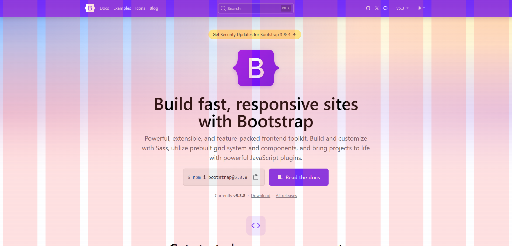
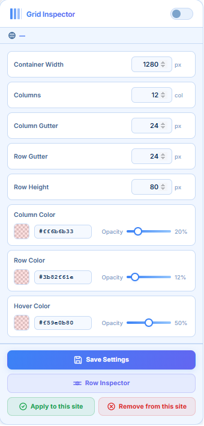

<p align="center">
  
</p>

<h1 align="center">Grid Layout Inspector</h1>

<p align="center">
  A Chrome extension that overlays a fully customizable design grid on any web page —<br/>
  columns, rows, colors, and an interactive <strong>Row Inspector</strong> for precise alignment checks.
</p>

<p align="center">
  <a href="LICENSE"></a>
  
  
  
</p>

<p align="center">
  
</p>


---

## Features

### 🗂 Column Grid
Display a multi-column overlay centered on the page with a configurable container width. Adjust the number of columns and column gutter to match any design system — 12-column Bootstrap, 24-column Figma, or anything custom.

### 📐 Row Grid
Add horizontal row bands on top of the column grid. Set the **Row Height** (band fill height) and **Row Gutter** (space between bands) independently. Together with the column overlay, they form a full design lattice for checking both vertical and horizontal alignment.

### 🎨 Independent Color Controls
Each overlay layer has its own color picker with full alpha/opacity support:
- **Column Color** — fill color for column bands (default: coral, 20% opacity)
- **Row Color** — fill color for row bands (default: blue, 12% opacity)
- **Hover Color** — highlight color used in Row Inspector mode (default: amber, 50% opacity)

All colors accept `#rrggbbaa` hex format, a native color picker, and an opacity slider — any change in one control instantly syncs the others.

### 🔍 Row Inspector Mode
An interactive hover-inspect tool to verify that elements sit on the same row.

1. Click the **Row Inspector** button in the popup
2. Move your cursor over the page — the row under your cursor lights up with the **Hover Color**
3. Click anywhere to exit · the crosshair cursor (`✛`) signals the mode is active

### 💾 Per-site Persistence
Settings and the list of enabled sites are stored with `chrome.storage.local`. The grid auto-restores on every page reload — no need to re-apply every session.

### ⚡ Global Toggle
The on/off switch in the popup header instantly shows or hides the grid on the current tab without losing your settings.

---

## Installation

### Developer Mode (recommended for local use)

1. **Clone** or download this repository
2. Open Chrome → `chrome://extensions/`
3. Enable **Developer mode** (top-right toggle)
4. Click **Load unpacked** → select this folder
5. The **Grid Inspector** icon appears in your toolbar

---

## Settings Reference

<table>
<tr>
<td>

| Field | Default | Description |
|---|---|---|
| Container Width | `1280 px` | Maximum width of the column grid (centered) |
| Columns | `12` | Number of vertical columns |
| Column Gutter | `24 px` | Gap between columns |
| Row Gutter | `24 px` | Transparent gap between row bands |
| Row Height | `80 px` | Height of each row band · `0` disables the row grid |
| Column Color | `#ff6b6b` @ 20% | Fill color for column bands |
| Row Color | `#3b82f6` @ 12% | Fill color for row bands |
| Hover Color | `#f59e0b` @ 50% | Highlight color in Row Inspector mode |

</td>
<td valign="top" align="center" width="240">



</td>
</tr>
</table>

---

## How to Use

```
1. Click the extension icon to open the popup
2. Adjust settings (columns, gutters, colors) to match your design system
3. Click [Save Settings] · changes are persisted automatically
4. Click [Apply to this site] to enable the grid on the current page
5. To check row alignment, click [Row Inspector] — hover rows highlight
6. Click anywhere on the page to exit Row Inspector mode
7. Click [Remove from this site] to disable the grid for this origin
```

---

## Project Structure

```
Grid Layout Inspector/
├── manifest.json              # Extension manifest (Manifest V3)
├── images/                    # Extension icons + preview
│   ├── icon16.png
│   ├── icon32.png
│   ├── icon48.png
│   ├── icon128.png
│   └── preview.png
│   └── popup.png
├── background/
│   └── background.js          # Service worker — relays messages to content scripts
├── content/
│   ├── content.js             # Grid overlay, row overlay, Row Inspector logic
│   └── content.css            # Minimal reset applied to overlay elements
└── popup/
    ├── popup.html             # Settings UI markup
    ├── popup.js               # UI logic, chrome.storage, tab messaging
    ├── popup.less             # Source styles (LESS) — edit this
    └── popup.css              # Compiled CSS — Chrome loads this directly
```

---

## Development

Styles are written in **LESS**. After editing `popup/popup.less`, recompile:

```bash
npx less popup/popup.less popup/popup.css
```

---

## Contributing

Contributions, bug reports, and feature requests are welcome!

- 🐛 **Bug reports** — open a GitHub issue with steps to reproduce
- 💡 **Feature requests** — open a GitHub issue with the `enhancement` label
- 🔧 **Pull requests** — please read [CONTRIBUTING.md](CONTRIBUTING.md) before submitting

---

## Changelog

See [CHANGELOG.md](CHANGELOG.md) for a full version history.

---

## License

Distributed under the [MIT License](LICENSE). © 2026 [hoangkhacphuc](https://github.com/hoangkhacphuc).
